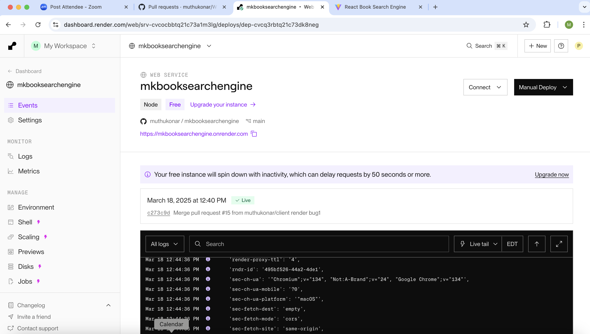
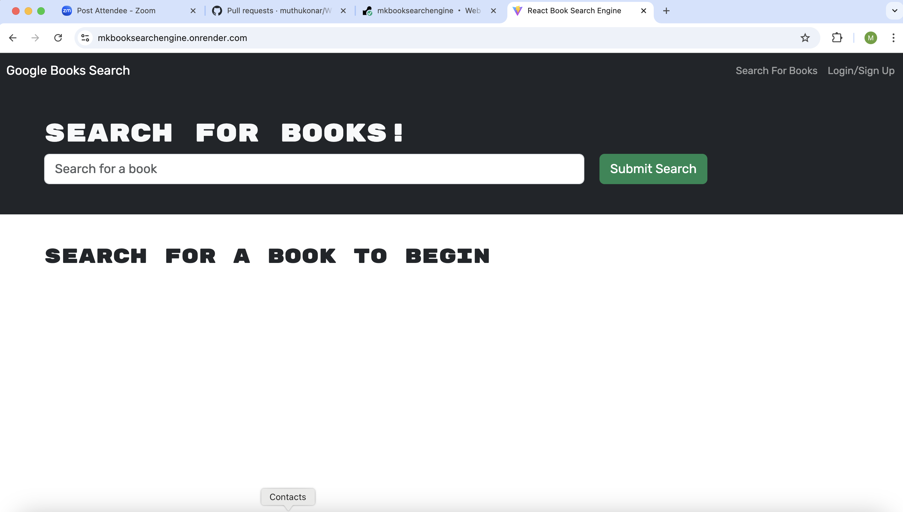
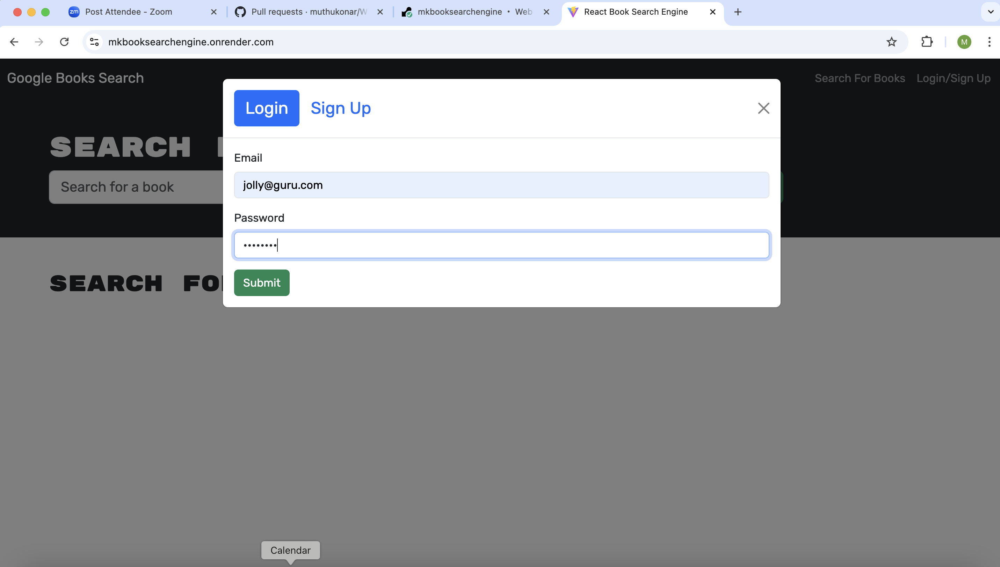
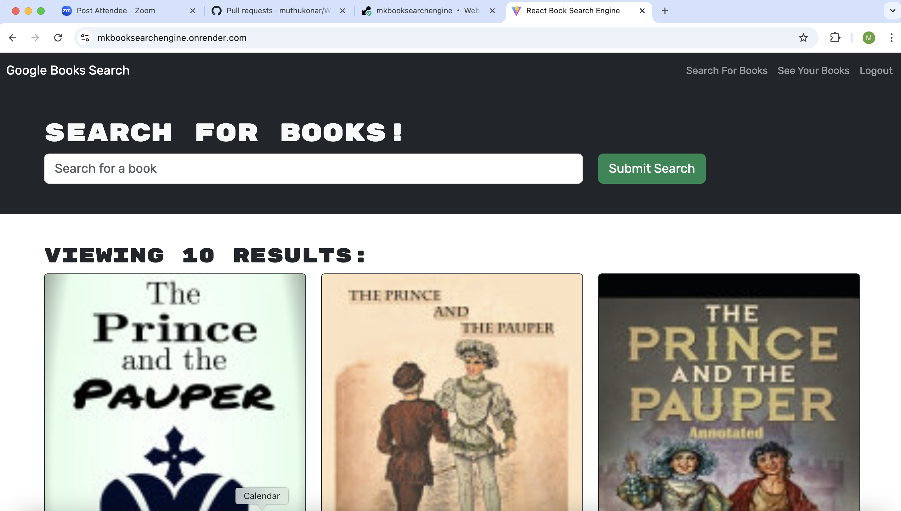
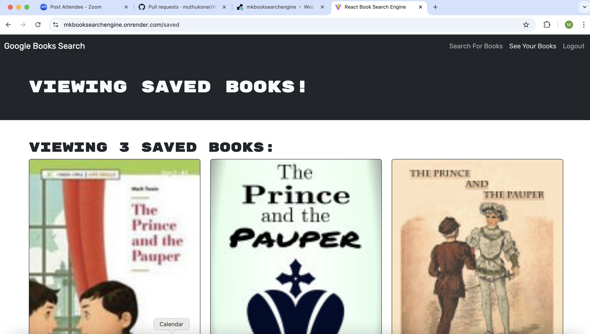
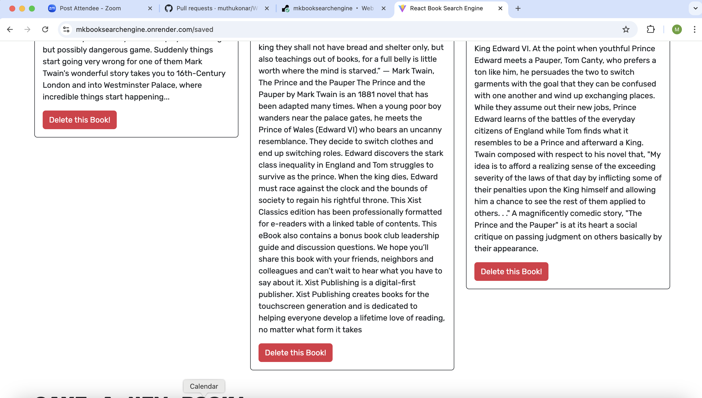
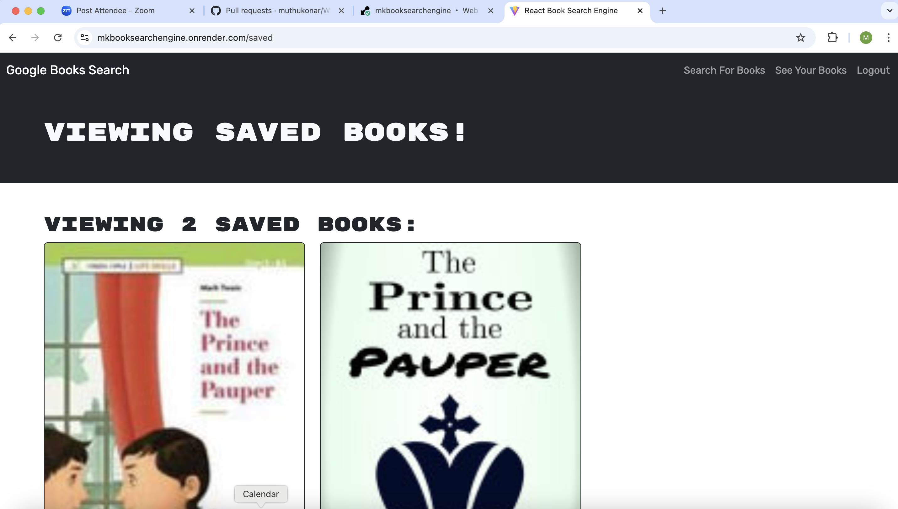

KoneTechI®  
  Mar, 2025
  
   
    
  # MK - BookSearchEngine

  ## Description
  Take a fully functioning Google Books API search engine built with a RESTful API, and refactor it to be a GraphQL API built with Apollo Server. The app was built using the MERN stack, with a React front end, MongoDB database, and Node.js/Express.js server and API. It's already set up to allow users to save book searches to the back end.

  ## Table of Contents

  - [Installation](#installation)
  - [Usage](#usage)
  - [credits]()
  - [Contributing](#contributing)
  - [Tests](#tests)
  - [Video](#video)
  - [Screenshots](#screenshots)
  - [License](#license)
  - [Questions](#questions)

## Installation
1. Creeate a repository in GitHUB.
2. Clone to VSCode locally 
3. Unzip and upload starter Code 
4. Once all code is developed  in an integrated terminal execute following command to start the application
   - npm  i 
   - npm client build, npm server build 
   - npm run start:dev - to start the application  ( to check if application works fine)
   - refactor it to be a GraphQL API built with Apollo Server.
   - Start the application - Test the functionility
   - Deploy to Render 

 5. Perform testing 
  - Refactor the code to use GraphQl and Apollo server
  - Start the application 
  - Deploy to Render
  - Test the functionality for search books, Save Books and Delete Books
  

## Usage
Test the functionality for search books, Save Books and Delete Books
  

## Credits
Instructor and TA's

## Contributing
Test and provide feedbacks 

 ## Tests
Test using Github pull requests and render link 

## Video

https://drive.google.com/file/d/1cuRB6Fw93K3RNmepnP2KeM7FY0qkCE9F/view?usp=sharing

## Screenshots 
Test results screenshots below

## License
This project is licensed under the MIT license.

## Questions
For any questions, please contact me at [pmkonar@gmail.com](mailto:pmkonar@gmail.com).
You can also find more of my work at [muthukonar](https://github.com/muthukonar).

'This document was last updated on Mar, 2025'
